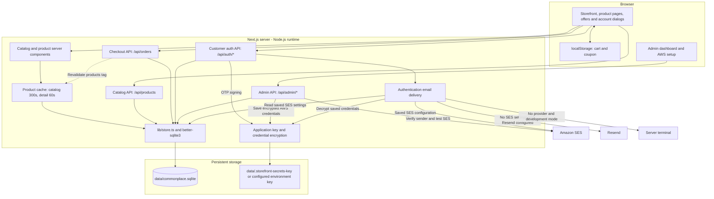
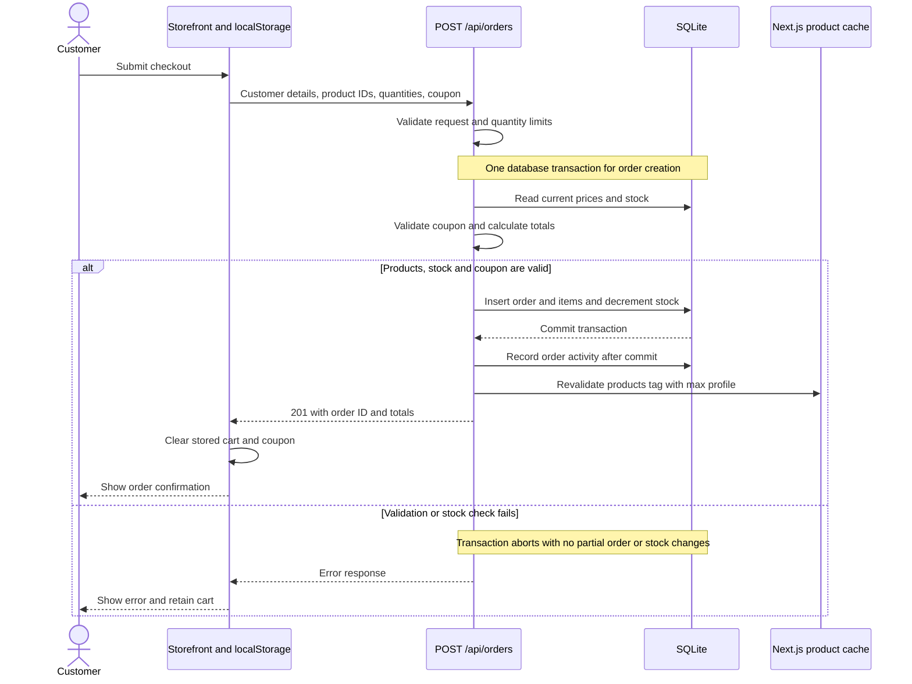
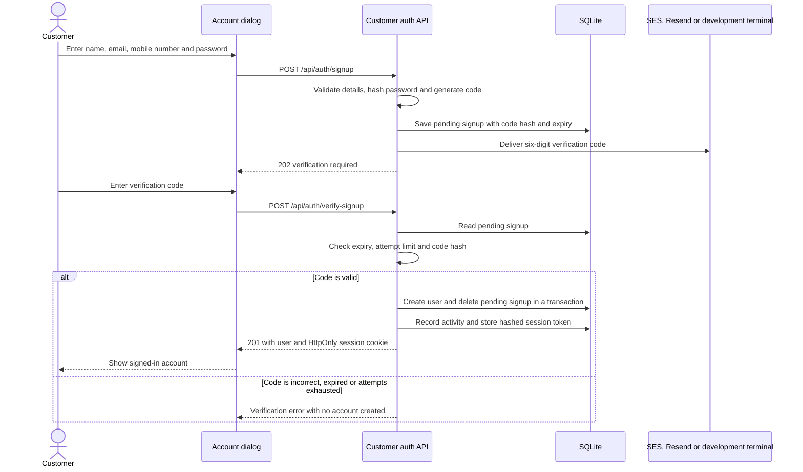

# Storefront

A full-stack homewares shop built with Next.js 16 App Router, React 19, TypeScript, Tailwind CSS 4, and SQLite. Includes a product catalog, persistent browser cart, coupon checkout, email-verified customer accounts, and an admin dashboard.

Checkout is a demo flow: orders update inventory, but no payment details are collected or processed.

## Project structure

- `app/storefront.tsx` contains the storefront, cart, checkout, and account dialogs.
- `app/products/[id]` and `app/offers` provide product details and promotions.
- `app/api` contains the catalog, order, customer-authentication, and admin APIs.
- `lib/store.ts` initializes SQLite and seeds the product catalog; `lib/auth.ts` handles password hashing and customer sessions.
- `lib/admin.ts` manages admin sessions and activity logging; `lib/aws-config.ts` and `lib/app-secrets.ts` manage email settings and encrypted credentials.
- `lib/offers.ts` defines coupons; `lib/products.ts` defines the seed catalog.
- `data/commonplace.sqlite` stores products, orders, accounts, sessions, admin activity, and integration settings.

## Architecture

The application runs as one Next.js Node.js server. Server-rendered catalog pages and API route handlers share the same SQLite database through `lib/store.ts`. These Mermaid diagrams render in GitHub's Markdown preview.

### Components and storage



Customer and admin authentication use separate HttpOnly session cookies with hashed tokens in SQLite. Admin overview and configuration APIs check the admin session. SES is selected before Resend; provider failures do not trigger a fallback to another provider.

### Checkout transaction

Prices, stock, and coupon eligibility are checked on the server. Checkout accepts customer details directly and does not require an account or call a payment provider.



The `max` revalidation profile marks cached products stale so they refresh on a subsequent visit. The checkout API always reads current database values, independently of the page cache.

### Email verification and account creation



The diagram shows successful code delivery; a failed send removes the newly saved pending code and returns an error. Password recovery uses the same delivery selection, storing its code in `password_reset_requests`. A valid reset updates the password, revokes existing customer sessions, and creates a new session in one transaction. Codes expire after 10 minutes, allow five attempts, and have a 60-second resend cooldown.

## License

This project is proprietary. All rights are reserved; copying, modifying, or distributing it requires prior written permission. See [LICENSE](LICENSE).

## Run locally

Use **Node.js 22 or later** and npm. The installed `better-sqlite3` dependency requires Node.js 22+.

```bash
npm ci
npm run dev
```

Open [http://localhost:3000](http://localhost:3000). SQLite initializes at `data/commonplace.sqlite` and inserts any missing seed products automatically; no separate database service or migration command is required.

Development admin credentials are `admin` / `admin` when both admin environment variables are unset. These defaults are available only when running `next dev`; production requires `ADMIN_USERNAME` and `ADMIN_PASSWORD`.

Available commands:

| Command | Purpose |
| --- | --- |
| `npm run dev` | Start the development server. |
| `npm run lint` | Run ESLint. |
| `npm run build` | Create the production build. |
| `npm start` | Serve the production build. |

## Configuration

Set environment variables in `.env.local` at the project root or in the hosting environment. `.env.local` is ignored by Git. Restart the server after changing it.

| Variable | Purpose |
| --- | --- |
| `ADMIN_USERNAME` | Admin login username; required with `ADMIN_PASSWORD` in production. |
| `ADMIN_PASSWORD` | Admin login password. Set a unique, strong value; production rejects the `admin` / `admin` pair. |
| `RESEND_API_KEY` | Resend API key for authentication emails when saved SES settings are absent. |
| `AUTH_EMAIL_FROM` | Sender address for Resend; required alongside `RESEND_API_KEY`. |
| `AWS_CONFIG_ENCRYPTION_KEY` | Optional application key: exactly 64 hexadecimal characters (32 bytes). Otherwise, the app generates `data/.storefront-secrets-key`. |
| `AUTH_OTP_SECRET` | Optional secret for signing signup and password-reset codes. Otherwise, purpose-specific secrets are derived from the application key. |

No environment variables are needed for the default local demo. Without an email provider, verification codes appear in the development server terminal. Production signup and password recovery require SES or Resend.

## Production

Configure the admin credentials and email delivery, then run:

```bash
npm run build
npm start
```

The app requires a Node.js server with a writable, persistent `data/` directory. Database initialization also runs during the build when product pages are prerendered. Preserve the database and application key across deployments and protect their backups. If you supply `AWS_CONFIG_ENCRYPTION_KEY`, preserve that value instead of relying on the generated key file. Losing or changing the key makes existing encrypted AWS credentials unreadable; restore the original key to recover them.

Serve production traffic over HTTPS because authentication cookies use the `Secure` flag. A payment provider must be implemented before checkout can accept real payments.

## Product pages and caching

Each item has a dynamic detail page at `/products/{id}`. Known product pages are prerendered and revalidated every 60 seconds; the catalog page revalidates every 5 minutes. Successful orders invalidate the shared product cache. The cart is stored in browser local storage so it survives navigation between product pages and the catalog.

## Offers and coupons

The Offers page is available at `/offers`. Current codes are `WELCOME10` (10% off $50+), `SLOW15` (15% off $100+), and `GATHER20` ($20 off $150+). Applying an offer stores it with the browser cart; checkout revalidates the code and minimum subtotal on the server. Orders persist subtotal, discount, coupon code, and final total.

## Store API

- `GET /api/products` returns the current catalog and stock.
- `POST /api/orders` validates customer details, stock, and coupon eligibility, then records the order and decrements inventory in one transaction.
- `POST /api/auth/signup` emails a signup verification code; pass `{ "resend": true, "email": "..." }` to resend after the cooldown.
- `POST /api/auth/verify-signup` verifies the emailed code, creates the account, and starts a session.
- `POST /api/auth/signin` verifies credentials and starts a session.
- `POST /api/auth/forgot-password` requests a short-lived email reset code without disclosing whether the account exists.
- `POST /api/auth/verify-password-reset` verifies the reset code, changes the password, revokes existing sessions, and starts a new session.
- `POST /api/auth/reset-password` verifies the signed-in user's current password, updates its hash, and revokes old sessions.
- `POST /api/auth/signout` ends the current session.
- `GET /api/auth/me` returns the current account, if signed in.

Signup collects a name, email, mobile number, and password. It creates the account only after the emailed six-digit code is verified. The mobile number is stored as contact information; it is not SMS-verified.

Forgot password is available in the sign-in dialog. The reset request returns the same response whether or not an account exists. A valid reset code is required before the new password is saved; successful reset revokes existing sessions and signs the user in.

Signup and password-reset codes expire after 10 minutes, allow five attempts, and have a 60-second resend cooldown. In development without an email provider, codes are printed in the terminal running `npm run dev`. Passwords are salted scrypt hashes; customer session tokens are stored as hashes and sent in an HttpOnly cookie.

## Admin and email

Open `/admin` to review customers, orders, inventory alerts, and the activity audit trail. Activity includes signup, sign-in/out, password reset, order placement, and admin access; browser-local product browsing and cart changes are not recorded.

In **Admin > AWS setup**, enter AWS access keys, region, output preference, and a verified SES sender. Use **Create SES identity** to register an absent sender, then open the verification email from AWS and confirm it. **Test SES identity** checks sender verification and reports whether the account is in sandbox mode. SES sandbox accounts can send only to verified recipient addresses; request production access from AWS SES to email arbitrary customers.

Signup and recovery email use the saved SES integration when configured. Otherwise they use Resend when `RESEND_API_KEY` and `AUTH_EMAIL_FROM` are set. A failed SES send does not automatically retry through Resend. Credentials are encrypted at rest with AES-256-GCM; the admin UI receives only a masked access-key hint. The integration uses the access keys saved in the dashboard. The output format is an app preference; the AWS SDK is used directly and the host's `~/.aws` files are not modified.

The SES integration needs permission to read/create the configured email identity and send email. The SES account-status check also reads account sending status when the IAM credentials permit it.

Admin API routes:

- `POST /api/admin/login` and `POST /api/admin/logout` start and end admin sessions.
- `GET /api/admin/overview` returns dashboard data.
- `GET`, `POST`, and `DELETE /api/admin/aws-config` read the settings summary, save settings, and remove the saved integration.
- `POST /api/admin/aws-config/verify-sender` requests SES sender verification.
- `POST /api/admin/aws-config/test` checks the configured SES identity and account status.

The overview and AWS configuration routes require an authenticated admin session.
