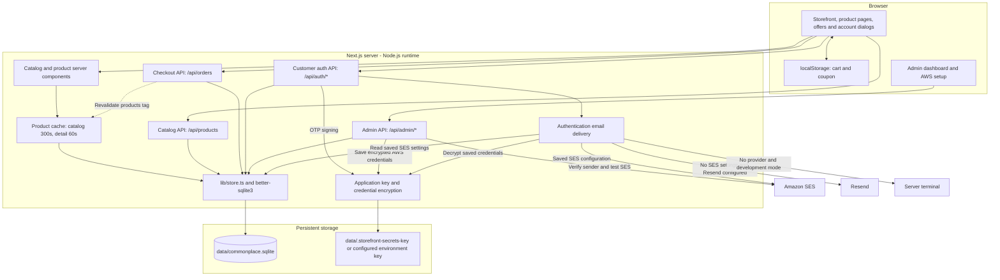
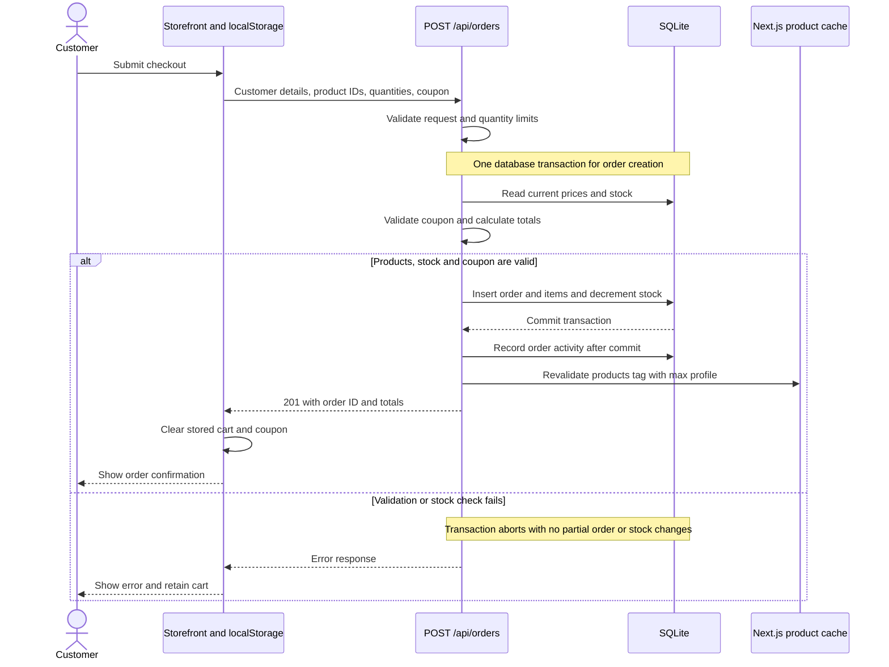
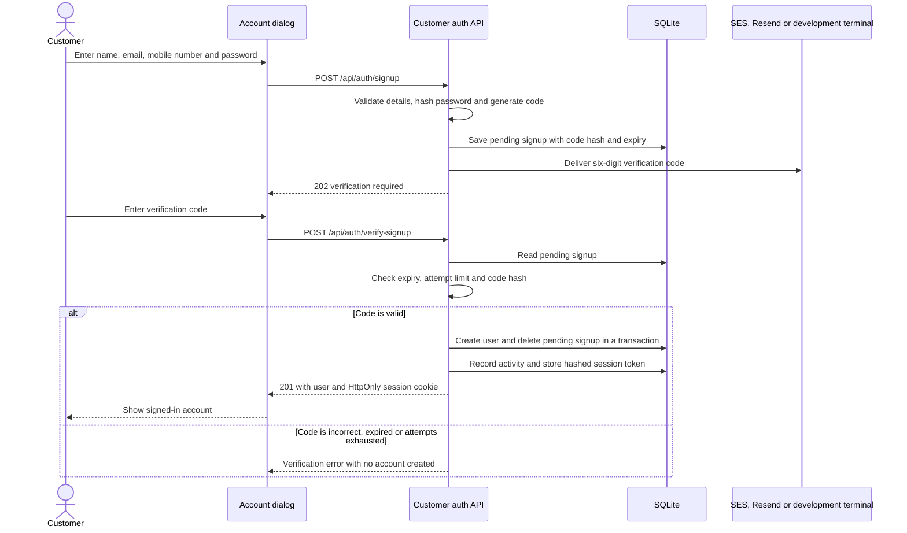

# E-Commerce Website – AWS DevOps Project

## 1. Project Overview

This project demonstrates an end-to-end DevOps CI/CD implementation for an E-Commerce Website using:

- GitHub
- Node.js
- npm
- SQLite
- Docker
- Jenkins
- GitHub Actions
- Terraform
- AWS
- Amazon EKS
- Kubernetes
- Load Balancer

---

## 2. Project Architecture

```text
Developer
    |
    v
GitHub Repository
    |
    v
CI/CD Pipeline
(Jenkins / GitHub Actions)
    |
    v
Docker Build
    |
    v
Docker Registry
    |
    v
Amazon EKS
    |
    v
Kubernetes Deployment
    |
    v
LoadBalancer
    |
    v
E-Commerce Website
```

---

## 3. Create Repository

Create a GitHub repository:

```text
AWS-DevOps-Project
```

Clone the repository:

```bash
git clone <repository-url>
cd AWS-DevOps-Project
```

---

## 4. Install Node.js

Download and install Node.js:

https://nodejs.org/en/download

Verify installation:

```bash
node -v
npm -v
```

---

## 5. Node.js / npm Setup

Initialize the project:

```bash
npm init
```

Check files:

```bash
ls
```

Install dependencies:

```bash
npm install
```

Install development dependencies:

```bash
npm install -D <package-name>
```

Check available scripts:

```bash
npm run
```

Build application:

```bash
npm run build
```

Run lint:

```bash
npm run lint
```

If a `compile` script exists in `package.json`:

```bash
npm run compile
```

---

## 6. SQLite Database

Go to the database directory:

```bash
cd data
```

Start SQLite:

```bash
sqlite3
```

Create or open database:

```bash
sqlite3 my_database.db
```

Check databases:

```sql
.databases
```

Open database:

```sql
.open filename.db
```

List tables:

```sql
.tables
```

Example query:

```sql
SELECT * FROM users
WHERE age > 21
ORDER BY name ASC;
```

---

# Jenkins CI/CD

## 7. Create Jenkins Server

Use Terraform to provision the Jenkins server.

```text
Terraform
   |
   v
Jenkins Server
```

Also use Terraform to provision the Amazon EKS cluster.

```text
Terraform
   |
   v
Amazon EKS
```

---

## 8. Install Jenkins Plugins

Open:

```text
Jenkins
>> Manage Jenkins
>> Plugins
```

Install:

- Docker
- Docker Pipeline
- Blue Ocean
- AWS Credentials

---

## 9. Configure Jenkins Credentials

Open:

```text
Jenkins
>> Manage Jenkins
>> Credentials
```

Add:

```text
GitHub Token
Docker Hub Token / Credentials
AWS Credentials
```

Never store passwords, tokens, or AWS keys directly in the Jenkinsfile.

---

## 10. Jenkins Pipeline Flow

```text
GitHub
   |
   v
Checkout
   |
   v
Docker Build
   |
   v
Docker Push
   |
   v
AWS Credentials
   |
   v
EKS Kubeconfig
   |
   v
kubectl
   |
   v
Kubernetes YAML
   |
   v
EKS Deployment
   |
   v
LoadBalancer
```

Use the Jenkins build number as the Docker image tag.

Example:

```text
docker.io/username/storefront:${BUILD_NUMBER}
```

---

# GitHub Actions CI/CD

## 11. Fork Application Repository

Fork:

https://github.com/atulkamble/storefront

---

## 12. Configure Docker Image

Open the GitHub Actions workflow file.

Update:

```yaml
IMAGE_NAME: your-username/storefront
```

Example:

```yaml
IMAGE_NAME: atuljkamble/storefront
```

---

## 13. Configure GitHub Secrets

Go to:

```text
GitHub Repository
>> Settings
>> Secrets and variables
>> Actions
>> New repository secret
```

Create:

```text
DOCKERHUB_USERNAME
DOCKERHUB_TOKEN
AWS_ACCESS_KEY_ID
AWS_SECRET_ACCESS_KEY
```

### Secrets Purpose

| Secret | Purpose |
|---|---|
| `DOCKERHUB_USERNAME` | Docker Hub username |
| `DOCKERHUB_TOKEN` | Docker Hub access token |
| `AWS_ACCESS_KEY_ID` | AWS access key |
| `AWS_SECRET_ACCESS_KEY` | AWS secret access key |

---

# Amazon EKS

## 14. Create EKS Cluster

Create the cluster:

```bash
eksctl create cluster \
  --name mycluster \
  --region us-east-1 \
  --nodegroup-name mynodes \
  --node-type t3.medium \
  --nodes 2 \
  --nodes-min 2 \
  --nodes-max 2 \
  --managed
```

---

## 15. Configure kubectl

Update kubeconfig:

```bash
aws eks update-kubeconfig \
  --name mycluster \
  --region us-east-1
```

Verify cluster:

```bash
kubectl get nodes
```

---

## 16. Verify Kubernetes Resources

Check nodes:

```bash
kubectl get nodes
```

Check pods:

```bash
kubectl get pods -o wide
```

Check services:

```bash
kubectl get svc
```

---

## 17. GitHub Actions Deployment Flow

```text
Developer
    |
    v
Git Push
    |
    v
GitHub Repository
    |
    v
GitHub Actions
    |
    v
Checkout
    |
    v
Docker Build
    |
    v
Docker Hub Login
    |
    v
Docker Push
    |
    v
AWS Authentication
    |
    v
Configure EKS
    |
    v
kubectl apply
    |
    v
EKS
    |
    v
LoadBalancer
```

---

# Access Application

## 18. Get LoadBalancer URL

Run:

```bash
kubectl get svc
```

You can also find the Load Balancer from:

```text
AWS Console
>> EC2
>> Load Balancers
>> Select Load Balancer
>> Copy DNS Name
```

Example:

```text
http://adce5f27e2c7548a48872b49a6ee7a02-1443550287.us-east-1.elb.amazonaws.com:3000/
```

Open the URL in a web browser.

---

# Cleanup

## 19. Delete EKS Cluster

After completing the lab, delete the cluster to avoid unnecessary AWS charges:

```bash
eksctl delete cluster \
  --name mycluster \
  --region us-east-1
```

---

# Important Points to Remember

1. Never commit AWS credentials or Docker Hub tokens to GitHub.
2. Use GitHub Actions Secrets for GitHub CI/CD.
3. Use Jenkins Credentials for Jenkins CI/CD.
4. Use unique Docker image tags for different builds.
5. Verify EKS before deployment:

```bash
kubectl get nodes
```

6. Verify pods after deployment:

```bash
kubectl get pods -o wide
```

7. Verify services:

```bash
kubectl get svc
```

8. Use the LoadBalancer hostname to access the application.
9. Delete unused AWS resources after completing the lab.
10. Monitor GitHub Actions or Jenkins logs when troubleshooting deployment failures.

---

## Complete CI/CD Flow

```text
Code
  |
  v
GitHub
  |
  v
Jenkins / GitHub Actions
  |
  v
Build
  |
  v
Test
  |
  v
Docker Build
  |
  v
Docker Push
  |
  v
Amazon EKS
  |
  v
Kubernetes Deployment
  |
  v
LoadBalancer
  |
  v
E-Commerce Website
```

---

## Useful Commands

```bash
# Node.js
node -v
npm -v
npm install
npm run build
npm run lint

# AWS
aws sts get-caller-identity
aws eks update-kubeconfig --name mycluster --region us-east-1

# Kubernetes
kubectl get nodes
kubectl get pods -o wide
kubectl get svc
kubectl get deployments

# EKS
eksctl get cluster
eksctl delete cluster --name mycluster --region us-east-1
```

---

# Project Summary

```text
Application      : E-Commerce Website
Source Control   : GitHub
Runtime          : Node.js
Package Manager  : npm
Database         : SQLite
Container        : Docker
CI/CD            : Jenkins / GitHub Actions
Infrastructure   : Terraform
Cloud            : AWS
Orchestration    : Kubernetes
Cluster          : Amazon EKS
Exposure         : AWS Load Balancer
```


# Storefront

A full-stack homewares shop built with Next.js 16 App Router, React 19, TypeScript, Tailwind CSS 4, and SQLite. Includes a product catalog, persistent browser cart, coupon checkout, email-verified customer accounts, and an admin dashboard.

Checkout is a demo flow: orders update inventory, but no payment details are collected or processed.

## Project structure

- `app/storefront.tsx` contains the storefront, cart, checkout, and account dialogs.
- `app/products/[id]` and `app/offers` provide product details and promotions.
- `app/api` contains the catalog, order, customer-authentication, and admin APIs.
- `lib/store.ts` initializes SQLite and seeds the product catalog; `lib/auth.ts` handles password hashing and customer sessions.
- `lib/admin.ts` manages admin sessions and activity logging; `lib/aws-config.ts` and `lib/app-secrets.ts` manage email settings and encrypted credentials.
- `lib/offers.ts` defines coupons; `lib/products.ts` defines the seed catalog.
- `data/commonplace.sqlite` stores products, orders, accounts, sessions, admin activity, and integration settings.

## Architecture

The application runs as one Next.js Node.js server. Server-rendered catalog pages and API route handlers share the same SQLite database through `lib/store.ts`. These Mermaid diagrams render in GitHub's Markdown preview.

### Components and storage



Customer and admin authentication use separate HttpOnly session cookies with hashed tokens in SQLite. Admin overview and configuration APIs check the admin session. SES is selected before Resend; provider failures do not trigger a fallback to another provider.

### Checkout transaction

Prices, stock, and coupon eligibility are checked on the server. Checkout accepts customer details directly and does not require an account or call a payment provider.



The `max` revalidation profile marks cached products stale so they refresh on a subsequent visit. The checkout API always reads current database values, independently of the page cache.

### Email verification and account creation



The diagram shows successful code delivery; a failed send removes the newly saved pending code and returns an error. Password recovery uses the same delivery selection, storing its code in `password_reset_requests`. A valid reset updates the password, revokes existing customer sessions, and creates a new session in one transaction. Codes expire after 10 minutes, allow five attempts, and have a 60-second resend cooldown.

## License

This project is proprietary. All rights are reserved; copying, modifying, or distributing it requires prior written permission. See [LICENSE](LICENSE).

## Run locally

Use **Node.js 22 or later** and npm. The installed `better-sqlite3` dependency requires Node.js 22+.

```bash
npm ci
npm run dev
```

Open [http://localhost:3000](http://localhost:3000). SQLite initializes at `data/commonplace.sqlite` and inserts any missing seed products automatically; no separate database service or migration command is required.

Development admin credentials are `admin` / `admin` when both admin environment variables are unset. These defaults are available only when running `next dev`; production requires `ADMIN_USERNAME` and `ADMIN_PASSWORD`.

Available commands:

| Command | Purpose |
| --- | --- |
| `npm run dev` | Start the development server. |
| `npm run lint` | Run ESLint. |
| `npm run build` | Create the production build. |
| `npm start` | Serve the production build. |

## Configuration

Set environment variables in `.env.local` at the project root or in the hosting environment. `.env.local` is ignored by Git. Restart the server after changing it.

| Variable | Purpose |
| --- | --- |
| `ADMIN_USERNAME` | Admin login username; required with `ADMIN_PASSWORD` in production. |
| `ADMIN_PASSWORD` | Admin login password. Set a unique, strong value; production rejects the `admin` / `admin` pair. |
| `RESEND_API_KEY` | Resend API key for authentication emails when saved SES settings are absent. |
| `AUTH_EMAIL_FROM` | Sender address for Resend; required alongside `RESEND_API_KEY`. |
| `AWS_CONFIG_ENCRYPTION_KEY` | Optional application key: exactly 64 hexadecimal characters (32 bytes). Otherwise, the app generates `data/.storefront-secrets-key`. |
| `AUTH_OTP_SECRET` | Optional secret for signing signup and password-reset codes. Otherwise, purpose-specific secrets are derived from the application key. |

No environment variables are needed for the default local demo. Without an email provider, verification codes appear in the development server terminal. Production signup and password recovery require SES or Resend.

## Production

Configure the admin credentials and email delivery, then run:

```bash
npm run build
npm start
```

The app requires a Node.js server with a writable, persistent `data/` directory. Database initialization also runs during the build when product pages are prerendered. Preserve the database and application key across deployments and protect their backups. If you supply `AWS_CONFIG_ENCRYPTION_KEY`, preserve that value instead of relying on the generated key file. Losing or changing the key makes existing encrypted AWS credentials unreadable; restore the original key to recover them.

Serve production traffic over HTTPS because authentication cookies use the `Secure` flag. A payment provider must be implemented before checkout can accept real payments.

Deploy the full application to a Node.js or Docker host with persistent storage. GitHub Pages serves the separate catalog preview described below; checkout, customer sessions, admin APIs, SQLite writes, and cache revalidation require the full server application.

## Docker

The multi-stage Dockerfile uses Node.js 22 on Debian, builds Next.js standalone output, and runs the app as the non-root `node` user. The image includes static assets and native SQLite dependencies. Local `.env` files, databases, and application keys are excluded from the build context and standalone output.

Build the image:

```bash
docker build -t storefront:local .
```

Create a local `.env.docker` file with your production settings. Use a unique password in place of the placeholder:

```dotenv
ADMIN_USERNAME=storefront-admin
ADMIN_PASSWORD=replace-with-a-unique-strong-password
```

Add `RESEND_API_KEY` and `AUTH_EMAIL_FROM` to that file if using Resend, or configure SES through the admin dashboard after startup. `.env.docker` is ignored by Git and Docker; it is passed to the container only at runtime.

```bash
docker volume create storefront-data
docker run --detach --name storefront \
  --publish 3000:3000 \
  --env-file .env.docker \
  --mount source=storefront-data,target=/app/data \
  storefront:local
```

Open [http://localhost:3000](http://localhost:3000) to check the catalog. Use HTTPS through a reverse proxy for production authentication. The container health check calls `/api/products`, exercising both the server and SQLite.

Keep the `storefront-data` volume when replacing the container: it holds the database and automatically generated application key. If using a host-directory bind mount instead, make it writable by the container's `node` user (UID/GID 1000). Run a single application instance with this local SQLite setup.

## GitHub Actions

[The CI workflow](.github/workflows/ci.yml) runs on pushes to `main`, pull requests, and manual dispatch. It runs ESLint with Node.js 22 and independently builds the production Docker image, which runs `next build` and its TypeScript checks.

The container job checks startup, a populated catalog, protected admin access, non-root execution, writable SQLite storage, and volume persistence across containers. npm and Docker build layers are cached. No repository secrets are required, and the workflow does not publish images or deploy the application.

## GitHub Pages storefront

[The public storefront preview](https://atulkamble.github.io/storefront/) is built from `pages-preview/`, which reuses the main app's layout, storefront, product pages, and offers. It reads the public seed catalog without opening SQLite. Search, filters, sorting, favorites, cart quantities, and coupons work in the browser. Account controls and checkout are unavailable in this preview; the Docker app retains those features.

```bash
npm run build:pages
```

The export is written to `pages-preview/out/`, with `/storefront` as its base path and directory-style URLs for product and offer pages. [The Pages workflow](.github/workflows/pages.yml) validates exports on pull requests and publishes them on pushes to `main` or manual runs. It uploads the generated website rather than the repository source.

In repository **Settings > Pages > Build and deployment**, select **GitHub Actions** as the source. Publishing directly from the `main` branch root invokes Jekyll and can display the README instead of the storefront. The full application still uses `npm run build` and `.next/standalone/` for Docker or Node.js hosting.

## Product pages and caching

Each item has a dynamic detail page at `/products/{id}`. Known product pages are prerendered and revalidated every 60 seconds; the catalog page revalidates every 5 minutes. Successful orders invalidate the shared product cache. The cart is stored in browser local storage so it survives navigation between product pages and the catalog.

## Offers and coupons

The Offers page is available at `/offers`. Current codes are `WELCOME10` (10% off $50+), `SLOW15` (15% off $100+), and `GATHER20` ($20 off $150+). Applying an offer stores it with the browser cart; checkout revalidates the code and minimum subtotal on the server. Orders persist subtotal, discount, coupon code, and final total.

## Store API

- `GET /api/products` returns the current catalog and stock.
- `POST /api/orders` validates customer details, stock, and coupon eligibility, then records the order and decrements inventory in one transaction.
- `POST /api/auth/signup` emails a signup verification code; pass `{ "resend": true, "email": "..." }` to resend after the cooldown.
- `POST /api/auth/verify-signup` verifies the emailed code, creates the account, and starts a session.
- `POST /api/auth/signin` verifies credentials and starts a session.
- `POST /api/auth/forgot-password` requests a short-lived email reset code without disclosing whether the account exists.
- `POST /api/auth/verify-password-reset` verifies the reset code, changes the password, revokes existing sessions, and starts a new session.
- `POST /api/auth/reset-password` verifies the signed-in user's current password, updates its hash, and revokes old sessions.
- `POST /api/auth/signout` ends the current session.
- `GET /api/auth/me` returns the current account, if signed in.

Signup collects a name, email, mobile number, and password. It creates the account only after the emailed six-digit code is verified. The mobile number is stored as contact information; it is not SMS-verified.

Forgot password is available in the sign-in dialog. The reset request returns the same response whether or not an account exists. A valid reset code is required before the new password is saved; successful reset revokes existing sessions and signs the user in.

Signup and password-reset codes expire after 10 minutes, allow five attempts, and have a 60-second resend cooldown. In development without an email provider, codes are printed in the terminal running `npm run dev`. Passwords are salted scrypt hashes; customer session tokens are stored as hashes and sent in an HttpOnly cookie.

## Admin and email

Open `/admin` to review customers, orders, inventory alerts, and the activity audit trail. Activity includes signup, sign-in/out, password reset, order placement, and admin access; browser-local product browsing and cart changes are not recorded.

In **Admin > AWS setup**, enter AWS access keys, region, output preference, and a verified SES sender. Use **Create SES identity** to register an absent sender, then open the verification email from AWS and confirm it. **Test SES identity** checks sender verification and reports whether the account is in sandbox mode. SES sandbox accounts can send only to verified recipient addresses; request production access from AWS SES to email arbitrary customers.

Signup and recovery email use the saved SES integration when configured. Otherwise they use Resend when `RESEND_API_KEY` and `AUTH_EMAIL_FROM` are set. A failed SES send does not automatically retry through Resend. Credentials are encrypted at rest with AES-256-GCM; the admin UI receives only a masked access-key hint. The integration uses the access keys saved in the dashboard. The output format is an app preference; the AWS SDK is used directly and the host's `~/.aws` files are not modified.

The SES integration needs permission to read/create the configured email identity and send email. The SES account-status check also reads account sending status when the IAM credentials permit it.

Admin API routes:

- `POST /api/admin/login` and `POST /api/admin/logout` start and end admin sessions.
- `GET /api/admin/overview` returns dashboard data.
- `GET`, `POST`, and `DELETE /api/admin/aws-config` read the settings summary, save settings, and remove the saved integration.
- `POST /api/admin/aws-config/verify-sender` requests SES sender verification.
- `POST /api/admin/aws-config/test` checks the configured SES identity and account status.

The overview and AWS configuration routes require an authenticated admin session.


Add all four as **GitHub Actions Repository Secrets**.

For your `storefront` repository, open:

**GitHub → Repository → Settings → Secrets and variables → Actions → Secrets → New repository secret**

Then create these one by one:

| Secret Name | Value to enter |
|---|---|
| `DOCKERHUB_USERNAME` | Your Docker Hub username, e.g. `atuljkamble` |
| `DOCKERHUB_TOKEN` | Docker Hub access token |
| `AWS_ACCESS_KEY_ID` | Your AWS IAM access key ID |
| `AWS_SECRET_ACCESS_KEY` | Your AWS IAM secret access key |

Your workflow then accesses them like this:

```yaml
- name: Docker Hub Login
  uses: docker/login-action@v3
  with:
    username: ${{ secrets.DOCKERHUB_USERNAME }}
    password: ${{ secrets.DOCKERHUB_TOKEN }}

- name: Configure AWS Credentials
  uses: aws-actions/configure-aws-credentials@v4
  with:
    aws-access-key-id: ${{ secrets.AWS_ACCESS_KEY_ID }}
    aws-secret-access-key: ${{ secrets.AWS_SECRET_ACCESS_KEY }}
    aws-region: us-east-1
```

### Where exactly?

```text
GitHub
└── atulkamble/storefront
    └── Settings
        └── Secrets and variables
            └── Actions
                └── Secrets
                    └── New repository secret
```

After adding them, you'll see the **names** listed under Repository secrets, but GitHub will not show their secret values again.

Do **not** put the actual passwords, tokens, or AWS secret keys directly inside `deploy.yml` or commit them to Git.
